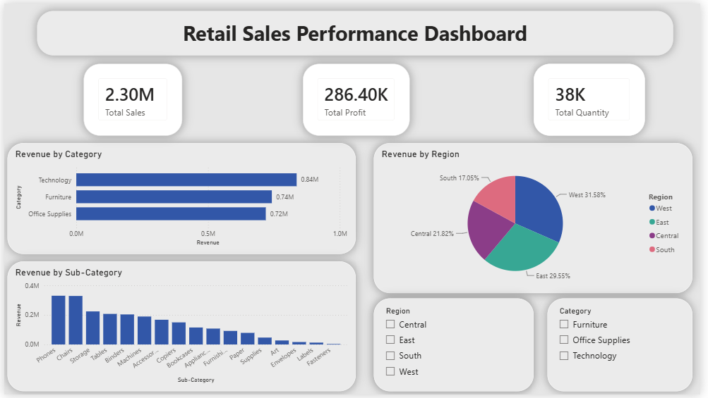

# 📊 Retail Sales Performance Dashboard

An interactive Power BI dashboard built to analyze retail sales data and transform raw business data into clear, actionable insights. The dashboard helps visualize sales performance, profitability, customer segments, and regional trends through an intuitive and interactive interface.

---

## 📌 Overview

This project uses the **Sample Superstore** dataset to explore retail sales performance and present key business metrics in a single dashboard. The goal was to build a clean, professional report that enables users to monitor KPIs, identify trends, and support data-driven decision-making.

---

## 🎯 Business Questions

- Which regions generate the highest sales and profit?
- Which product categories perform the best?
- How do sales change over time?
- Which customer segments contribute the most revenue?
- What are the overall business KPIs?

---

## 🛠️ Tools & Skills

- Power BI
- DAX
- Power Query
- Microsoft Excel
- Data Cleaning
- Data Modeling
- Data Visualization
- KPI Reporting
- Business Intelligence

---

## 📊 Dashboard Features

- Executive KPI Cards
- Sales & Profit Analysis
- Regional Performance
- Category Analysis
- Customer Segment Analysis
- Monthly Sales Trend
- Interactive Filters & Slicers

---

## 📈 Key Insights

- Identified top-performing regions and product categories.
- Compared customer segments based on sales performance.
- Analyzed monthly sales trends to identify business patterns.
- Built interactive visuals to support faster business decisions.

---

## 📷 Dashboard Preview



---

## 📁 Project Structure

```
Retail-Sales-Performance-Dashboard/
│
├── images/
│   └── dashboard.png
├── Retail Sales Dashboard.pbix
├── SampleSuperstore.csv
├── README.md
└── .gitignore
```

---

## 🚀 What I Learned

This project strengthened my understanding of data cleaning, dashboard design, DAX, and data visualization in Power BI. It also improved my ability to communicate business insights through interactive reports instead of raw data.

---

## 👨‍💻 Author

**Binayak Deb**

**Data Analyst | SQL • Power BI • Python • Excel**